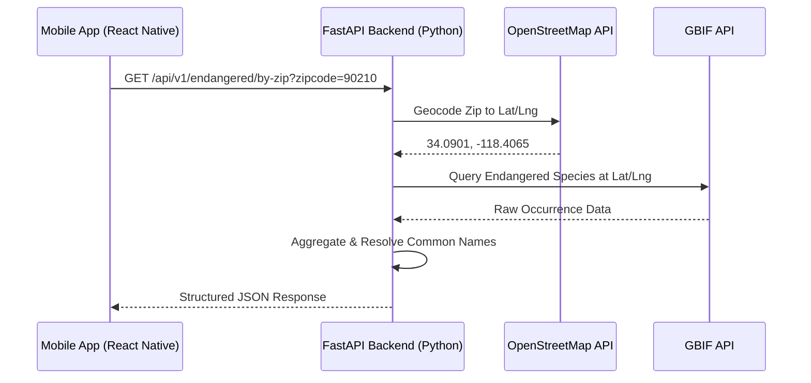

# EcoRadius 🌍

**EcoRadius** is an open-source platform that allows users to discover endangered wildlife species within a specific US Zip Code. 

This repository is a **monorepo** containing both the backend API and the frontend mobile application. It is designed to be highly scalable, thoroughly documented, and easy to run locally without any complex setup or external API keys.

---

## 🏗 Architecture & Tech Stack

The platform is divided into a robust backend and a fluid mobile frontend. They communicate via RESTful HTTP endpoints.

### Tech Stack
- **Frontend**: React Native, Expo, JavaScript
- **Backend**: Python 3.10+, FastAPI, Pydantic, Uvicorn
- **External Data Sources**: 
  - OpenStreetMap (Nominatim API) for Geocoding
  - Global Biodiversity Information Facility (GBIF API) for Species Data
- **CI/CD**: Bitrise (Local Android APK Pipeline)

### System Flow


---

## 📊 Data Schemas

The API is fully typed using **Pydantic**. Here is the standard JSON response schema when successfully querying a zip code.

### Endpoint: `GET /api/v1/endangered/by-zip`

**Example Response:**
```json
{
  "query_location": {
    "lat": 34.0901,
    "lng": -118.4065,
    "zipcode": "90210",
    "country": "US",
    "radius_km": 10.0
  },
  "total_unique_species": 1,
  "species": [
    {
      "scientific_name": "Puma concolor",
      "common_name": "Mountain Lion",
      "kingdom": "Animalia",
      "status": "Endangered",
      "occurrences_found": 14
    }
  ]
}
```

---

## 🚀 Quick Start (Local Setup)

The project is designed to run locally right out of the box. **No external API keys or secrets are required to run this project.** It uses public, open APIs.

### 1. Running the Backend API
The API is located in the root of this repository.

**Prerequisites**: Python 3.10+
```bash
# 1. Create and activate a virtual environment
python3 -m venv venv
source venv/bin/activate

# 2. Install dependencies
pip install -r requirements.txt

# 3. Start the FastAPI server on port 8000 (in the background)
python main.py &

# Note: Press Enter if the logs overlay your prompt. To stop the server later, type `fg` then press CTRL+C.
```
*The API will be available at `http://localhost:8000` with interactive docs at `http://localhost:8000/docs`.*

### 2. Running the Mobile App
The mobile app is located in the `mobile` directory.

**Prerequisites**: Node.js 18+
```bash
# 1. Navigate to the mobile directory
cd mobile

# 2. Install NPM dependencies
npm install

# 3. Start the Expo development server
npm start
```
*Use the Expo Go app on your physical device, or press `a` to run on an Android emulator, or `w` for the web interface.*

### 3. Running End-to-End Locally
After starting the backend API, you can run the mobile app and verify it connects successfully.

1. Start the backend from the repo root:
```bash
python main.py &
```
2. Confirm the API is live at:
   - `http://localhost:8000`
   - `http://localhost:8000/docs`
3. In the `mobile` directory, install dependencies and start Expo:
```bash
cd mobile
npm install
npm start
```
4. Open Expo on a device or emulator and confirm the app loads data from the backend.

This setup is ideal for local verification before pushing updates or running the CI/CD workflow.

## ⚙️ Bitrise Automated Workflow & Local Playback

The project features a fully automated end-to-end local playback pipeline configured in [bitrise.yml](file:///home/deck/.gemini/antigravity/scratch/ecoradius-api/mobile/bitrise.yml). 

It is designed to set up everything needed for developer testing and live interview demos in a single command. The workflow performs the following stages:

1. **Install & Start Backend API**: Installs backend Python packages, starts the FastAPI server in the background, bound to `0.0.0.0` (accepts external network traffic), and verifies it is healthy.
2. **Install Mobile Dependencies & Run Tests**: Pulls packages and executes unit tests.
3. **Start background Metro Server**: Launches the Expo/Metro bundler in the background on port `8085` (avoiding system-level conflicts on port `8081`).
4. **Compile Multi-Architecture APK**: Generates a native Android debug APK compiled for both `arm64-v8a` (physical devices) and `x86_64` (emulators), exporting it to `artifacts/ecoradius.apk`.
5. **Auto-Forward Ports (ADB Reverse)**: 
   * Maps `8081` (phone) to `8085` (host) to stream JavaScript code directly over USB.
   * Maps `8000` (phone) to `8000` (host) to route API queries directly to the Steam Deck backend without local Wi-Fi router dependencies.
6. **Deploy & Launch**: Streams the installation of the APK directly onto a physical Android device connected via USB (with USB debugging enabled) and opens the app automatically.

### Running the Entire Automated Pipeline:

Simply connect your Android phone via USB (ensure USB debugging is enabled in developer settings) and run:

```bash
cd mobile
bitrise run primary
```

Once completed, the app will instantly boot on your phone and talk directly to the backend API running on your host machine!

---

## 📄 License

This project is licensed under the **MIT License**. See the [LICENSE](LICENSE) file for more details.
