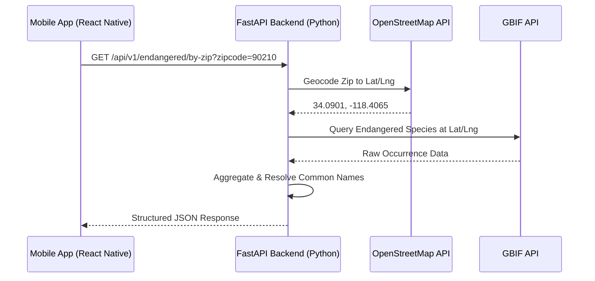

# EcoRadius 🌍

**EcoRadius** is an open-source platform that allows users to discover endangered wildlife species within a specific US Zip Code. 

This repository is a **monorepo** containing both the backend API and the frontend mobile application. It is designed to be highly scalable, thoroughly documented, and easy to run locally without any complex setup or external API keys.

---

## 🏗 Architecture & Tech Stack

The platform is divided into a robust backend and a fluid mobile frontend. They communicate via RESTful HTTP endpoints.

### Tech Stack
- **Frontend**: React Native, Expo, JavaScript
- **Backend**: Python 3.10+, FastAPI, Pydantic, Uvicorn
- **External Data Sources**: 
  - OpenStreetMap (Nominatim API) for Geocoding
  - Global Biodiversity Information Facility (GBIF API) for Species Data
- **CI/CD**: Bitrise (Local Android APK Pipeline)

### System Flow


---

## 📊 Data Schemas

The API is fully typed using **Pydantic**. Here is the standard JSON response schema when successfully querying a zip code.

### Endpoint: `GET /api/v1/endangered/by-zip`

**Example Response:**
```json
{
  "query_location": {
    "lat": 34.0901,
    "lng": -118.4065,
    "zipcode": "90210",
    "country": "US",
    "radius_km": 10.0
  },
  "total_unique_species": 1,
  "species": [
    {
      "scientific_name": "Puma concolor",
      "common_name": "Mountain Lion",
      "kingdom": "Animalia",
      "status": "Endangered",
      "occurrences_found": 14
    }
  ]
}
```

---

## 🚀 Quick Start (Local Setup)

The project is designed to run locally right out of the box. **No external API keys or secrets are required to run this project.** It uses public, open APIs.

### 1. Running the Backend API
The API is located in the root of this repository.

**Prerequisites**: Python 3.10+
```bash
# 1. Create and activate a virtual environment
python3 -m venv venv
source venv/bin/activate

# 2. Install dependencies
pip install -r requirements.txt

# 3. Start the FastAPI server on port 8000
python main.py
```
*The API will be available at `http://localhost:8000` with interactive docs at `http://localhost:8000/docs`.*

### 2. Running the Mobile App
The mobile app is located in the `mobile` directory.

**Prerequisites**: Node.js 18+
```bash
# 1. Navigate to the mobile directory
cd mobile

# 2. Install NPM dependencies
npm install

# 3. Start the Expo development server
npm start
```
*Use the Expo Go app on your physical device, or press `a` to run on an Android emulator, or `w` for the web interface.*

---

## ⚙️ CI/CD Pipeline

The mobile application utilizes **Bitrise** for its continuous integration and delivery pipeline. The local `bitrise.yml` workflow is fully configured to compile a native Android `.apk` artifact directly from the source code.

To execute the pipeline locally:
```bash
cd mobile
bitrise run primary
```

## 📄 License

This project is licensed under the **MIT License**. See the [LICENSE](LICENSE) file for more details.
